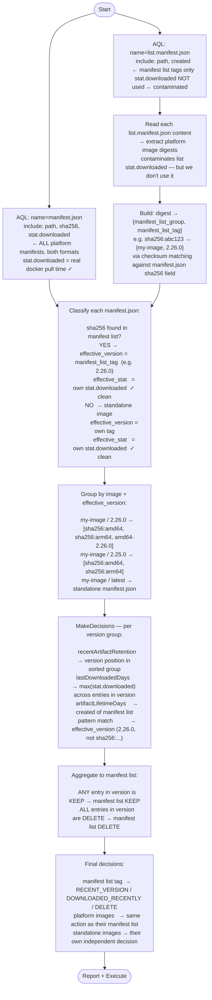

# Docker Cleanup Flow

## Problem: stat.downloaded contamination

Every time the cleaner reads `list.manifest.json` to extract platform image digests,
Artifactory records a download event and updates `stat.downloaded` on that file.
This makes every manifest list look "recently downloaded" on the next run.

**Root cause:** any HTTP GET of file content updates download stats in Artifactory,
regardless of endpoint (direct download, Docker Registry v2 API, custom headers — all tested).

**Solution:** don't use `stat.downloaded` from manifest list files at all.
Instead, use `stat.downloaded` from `manifest.json` platform image files.
The cleaner never reads platform image content — only the manifest list.
So platform image stats reflect actual `docker pull` events only.

---

## Flow



---

## Why platform image stats are clean

| File | Updated by cleaner reads? | Updated by docker pull? |
|------|--------------------------|------------------------|
| `list.manifest.json` | ✅ Yes — read to get digests | ✅ Yes |
| `sha256:xxx/manifest.json` | ❌ No | ✅ Yes |
| `sha256:xxx/sha256__hash` (OCI blob) | ❌ No | ✅ Yes |
| `amd64-2.26.0/manifest.json` | ❌ No | ✅ Yes |

The cleaner reads only `list.manifest.json` files.
Platform image files are identified via checksum matching — no HTTP content fetch.

---

## Key design decisions

### Pattern matching uses manifest list tag, not platform image tag

Without this, platform images would fail pattern matching:

| Platform image path | Own tag (wrong for matching) | Effective tag (correct) |
|--------------------|------------------------------|------------------------|
| `sha256:abc123/manifest.json` | `sha256:abc123` ← doesn't match `\d+\.\d+\.\d+` | `2.26.0` ✓ |
| `amd64-2.26.0/manifest.json` | `amd64-2.26.0` ← doesn't match `\d+\.\d+\.\d+` | `2.26.0` ✓ |
| `sha256:def456/manifest.json` | `sha256:def456` ← doesn't match `.*-SNAPSHOT` | `2.26.0-SNAPSHOT` ✓ |

### Manifest list is deleted only when ALL platform images are deleted

If any platform image was pulled within `lastDownloadedDays`, the whole image
(manifest list + all platform images) is retained. This is conservative and correct:
if any platform was actually used, the manifest list should survive.

### lastDownloadedDays uses max download time across all platform images

```
for digest in manifest_list.manifests[].digest:
    paths = checksumIndex[digest]          // all paths sharing this sha256
    for path in paths:
        pull_times.append(path.stat_downloaded)

effective_last_pull = max(pull_times)
```

If arm64 was pulled 3 days ago and amd64 was never pulled, `effective_last_pull = 3 days ago`.
A `lastDownloadedDays: 7` config would keep the whole manifest list.

### Checksum index links platform images to their manifest list

```
AQL: name=manifest.json → sha256 field (content hash)

manifest list content:
  manifests[0].digest = sha256:abc123  ← content hash of arm64 manifest
  manifests[1].digest = sha256:def456  ← content hash of amd64 manifest

checksumIndex:
  abc123 → [my-image/sha256:abc123, my-image/arm64-2.26.0]  ← same binary
  def456 → [my-image/sha256:def456, my-image/amd64-2.26.0]
```

Both path variants (sha256-addressed and named arch tag) are matched by the same
checksum and receive the same decision.

---

## Stat contamination: before vs after

**Before (current):**
```
Run 1: AQL captures real manifest list stat → decisions correct ✓
        cleaner reads list.manifest.json → stat.downloaded = now ✗
Run 2: AQL sees stat.downloaded = yesterday → everything DOWNLOADED_RECENTLY
Run N: accumulates — nothing gets deleted by download recency rule ✗
```

**After (proposed):**
```
Run 1: AQL captures real platform image stat → decisions correct ✓
        cleaner reads list.manifest.json → contaminates list stats (ignored)
        platform image stats: untouched ✓
Run 2: AQL captures same clean platform image stats → decisions correct ✓
Run N: always correct ✓
```

---

## Implementation plan

### 1. `artifactory/client.go`
- Extend `FindManifestChecksums` to also include `stat.downloaded`:
  ```go
  // sha256 → [{Path, DownloadedAt}]
  func (c *Client) FindManifestChecksums(ctx, repo) (map[string][]ManifestStat, error)
  ```
- AQL includes `path, sha256, stat.downloaded`

### 2. `artifactory/model.go`
- Add `ManifestStat struct { Path string; DownloadedAt *time.Time }`
- Update `Repository` interface

### 3. `strategy/docker/multiplatform.go`
- `planMultiPlatform`:
  - AQL for `list.manifest.json`: include only `path, created` (no stat)
  - AQL for `manifest.json`: include `path, sha256, stat.downloaded` (already done)
  - Read manifest list content → build `digest → manifest_list_tag` map
  - For each `manifest.json`: if sha256 in digest map → set effective version = manifest list tag,
    set LastDownloadedAt = own stat.downloaded
  - Group by (image, effective_version) → `BuildDecisionMap`
  - `MakeDecisions` runs normally
  - Aggregate: manifest list kept if ANY entry in version is not DELETE

### 4. Tests
- `TestMakeDecisions_PlatformImageRecentlyPulled_KeepsManifestList`
- `TestMakeDecisions_AllPlatformImagesOld_ManifestListDeleted`
- `TestMakeDecisions_ContaminatedManifestStatIgnored`
- `TestMakeDecisions_EffectiveVersionUsedForPatternMatch`
